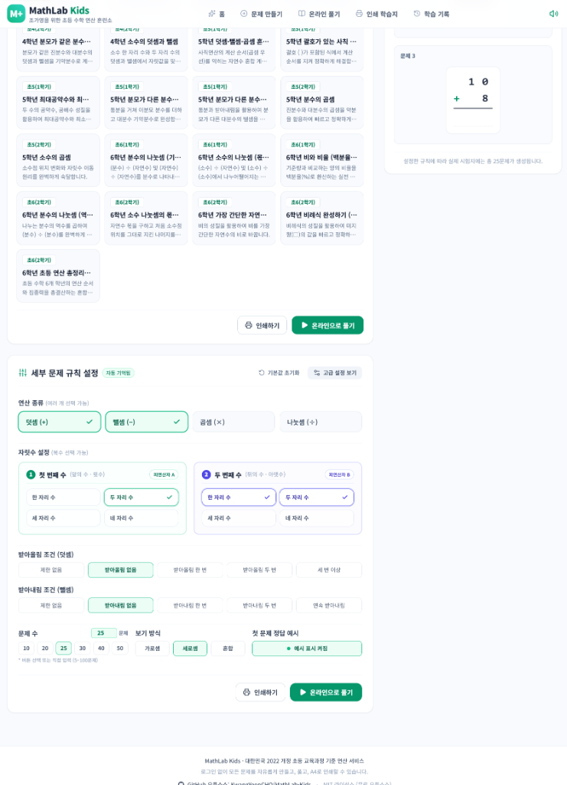
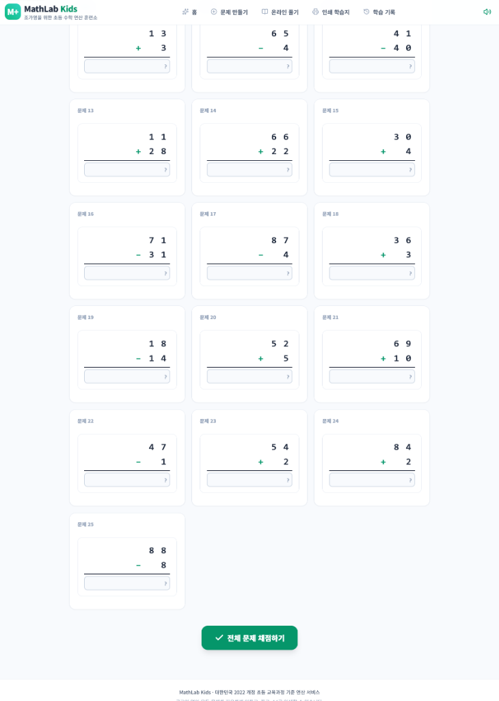
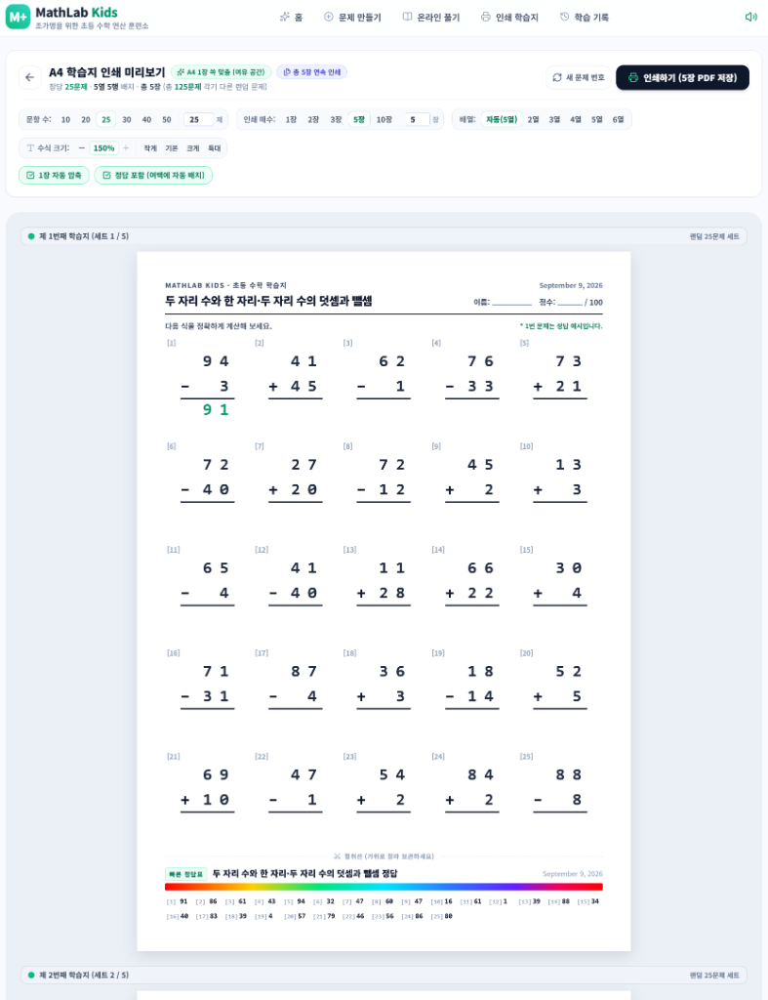

# 📐 MathLab Kids (매쓰랩 키즈)

> **대한민국 2022 개정 초등 수학 교육과정 기준 맞춤형 연산 학습 및 A4 학습지 자동 생성 플랫폼**  
> *로그인 없음 · 광고 없음 · 100% 무료 오픈소스 · 개인정보 수집 제로*

---

[](https://nextjs.org/)
[](https://react.dev/)
[](https://www.typescriptlang.org/)
[](https://tailwindcss.com/)
[](LICENSE)

---

## 🌟 프로젝트 소개 (About MathLab Kids)

**MathLab Kids**는 초등학교 학생들의 기초 수학 연산 능력을 체계적이고 즐겁게 기를 수 있도록 고안된 웹 기반 교육 플랫폼입니다.  
시중 학습지의 획일화된 문제에서 벗어나, **선생님과 학부모가 아이의 연산 발달 단계에 맞춰 정밀한 규칙(받아올림 횟수, 자릿수, 나눗셈 나머지 등)을 직접 설계**할 수 있습니다.

화면에서 태블릿과 가상 키패드로 재미있게 푸는 **온라인 인터랙티브 연습실**과, 불필요한 여백을 자동으로 압축하여 단 한 장의 종이에 완벽하게 인쇄되는 **A4 학습지 인쇄 엔진**을 모두 제공합니다.

---

## 📸 주요 화면 미리보기 (Screenshots)

### 1. 메인 홈 화면 — 학년·학기별 맞춤 추천 프리셋 (29종 완비)


- **2022 개정 교육과정 12개 학기 체계**: 초등학교 1학년부터 6학년까지 1학기와 2학기로 세분화된 총 29종의 공식 연산 프리셋 탑재.
- **직관적인 2단계 필터링**: `전체 / 1~6학년` 1차 학년 탭과 `전체 학기 / 1학기 전체 / 2학기 전체` 2차 서브 필터로 원하는 단원의 연산 세트를 원클릭 선별.
- **시인성 높은 학기 뱃지**: `초1(1학기)`, `초4(2학기)` 등 고대비 직관적 뱃지로 학년과 진도를 한눈에 파악.
- **원클릭 다이렉트 실행**: 각 프리셋 카드에서 즉시 `풀기` 또는 `인쇄`로 진입 가능.

---

### 2. 세부 문제 규칙 설정 — 정밀 커스텀 엔진 & 액션 버튼


- **정밀한 교육 연산 파라미터 제어**:
  - **연산 종류**: 덧셈(+), 뺄셈(-), 곱셈(×), 나눗셈(÷) 단일 또는 복수 선택
  - **자릿수 설정**: 첫 번째 수와 두 번째 수의 자릿수(1~4자리) 및 자연수 조건 독립 지정
  - **받아올림 / 받아내림 제어**: 없음, 한 번, 두 번, 연속 받아내림 등 아이의 발달 수준에 맞춤 설계
  - **문제 수 및 보기 방식**: 10~100문제 자유 지정, 가로셈 / 세로셈 / 혼합 레이아웃 지원
  - **첫 문제 정답 예시**: 풀이 가이드가 필요한 저학년을 위한 예시 문제 표시 기능
- **작업 편의성을 높인 하단 액션 버튼**: 상단 헤더뿐만 아니라 규칙 설정 카드 및 프리셋 카드 하단 우측에도 `[인쇄하기]` / `[온라인으로 풀기]` 버튼을 동일 비즈니스 로직으로 배치하여 긴 스크롤 없이 즉시 학습 시작.

---

### 3. 스마트 온라인 연산 연습실 — 자율 적응형 입력창 & 실시간 채점


- **글자 크기 자율 적응 (Adaptive Font Sizing)**: 입력된 글자 수와 플레이스홀더 길이에 따라 폰트 크기가 자동으로 최적화되어 박스 테두리 밖으로 글자가 잘리거나 밀리는 현상 원천 차단.
- **아동 친화적 수식 인터페이스**: 실제 학습지와 동일한 깔끔한 세로셈·가로셈 그리드 레이아웃과 집중도를 높이는 큰 글씨 배치.
- **다이내믹 실시간 채점**: 문제 입력 즉시 실시간 피드백(효과음 및 정답/오답 뱃지)을 제공하며, 상단에 진행 상황과 실시간 점수(100점 만점)를 정직하게 반영.

---

### 4. A4 1장 완벽 맞춤 학습지 인쇄 엔진 — 자동 압축 & 절취선 정답표


- **지능형 자동 압축 배분 (A4 1장 쏙 맞춤)**: 25~30문항 이상의 세로셈도 A4 1장 높이 내에 여백 없이 꽉 차게 자동 조율되어 2페이지로 넘어가지 않고 깔끔하게 출력.
- **수식 글자 크기 커스텀**: 저학년을 위한 큰 글씨(150% 등)부터 고학년을 위한 콤팩트 배열까지 자유롭게 확대/축소.
- **대량 인쇄 지원**: 한 번에 1장~5장 등 각기 다른 난수의 랜덤 문제 세트를 다권 연속 인쇄.
- **하단 절취선 및 빠른 정답표 (Answer Key)**: 하단 가위 절취선과 함께 콤팩트한 1열 정답표를 자동 생성하여 학습지 채점 편의 제공.

---

## ✨ 핵심 기능 (Key Features)

### 1. 🎯 2022 개정 교육과정 기준 연산 규칙 엔진
- **학년·학기별 표준 프리셋 (초1 ~ 초6 총 12개 학기 29종 완비)**:
  - **1학년 (1학기/2학기)**: 10 이하 한 자리 수 덧셈/뺄셈, 두 자리 수 세로셈 기초
  - **2학년 (1학기/2학기)**: 두 자리 수 덧셈(받아올림 1회), 두 자리 수 뺄셈(받아내림 1회), 곱셈구구(2~9단), 덧셈/뺄셈 완성
  - **3학년 (1학기/2학기)**: 세 자리 수 덧셈/뺄셈, 두 자리 × 한 자리, 나머지가 없는/있는 나눗셈, 세 자리 × 한 자리
  - **4학년 (1학기/2학기)**: 여러 자리 수 곱셈과 나눗셈, 동분모 분수의 덧셈/뺄셈, 소수의 덧셈과 뺄셈
  - **5학년 (1학기/2학기)**: 자연수 혼합 계산, 괄호 혼합 계산, 최대공약수/최소공배수, 이분모 분수의 덧셈/뺄셈, 분수의 곱셈, 소수의 곱셈
  - **6학년 (1학기/2학기)**: 분수의 나눗셈(기초), 소수의 나눗셈(몫), 비와 비율(백분율 %), 분수의 나눗셈(역수 곱셈), 소수 나눗셈의 몫과 나머지, 가장 간단한 자연수의 비, 비례식 완성하기, 사칙 혼합 심화 총정리
- **직관적 2단계 필터링**: 학년별 1차 탭 + 학기별 2차 서브 필터(`전체 학기`, `1학기`, `2학기`)로 맞춤형 프리셋 즉시 선별
- **자유로운 커스텀 제어**:
  - 덧셈, 뺄셈, 곱셈, 나눗셈 단일 또는 혼합 연산 선택
  - 받아올림(`none`, `once`, `twice`, `more`, `any`) 정밀 설정
  - 받아내림(`none`, `once`, `twice`, `continuous`, `any`) 정밀 제어
  - 나눗셈 나머지 조건 (`none`: 나누어떨어짐, `required`: 나머지 필수, `mixed`: 혼합)
  - 자릿수 지정(1자리~4자리) 및 일의 자리 0 끝수 허용 여부 제어
  - 교환법칙 중복 제외 필터링 ($3 \times 7$과 $7 \times 3$ 중복 방지)
  - **설정 자동 기억 (Local Persistence)**: 모든 설정값은 브라우저에 자동 저장되어 새로고침 후에도 유지
  - **하단 액션 버튼 지원**: 규칙 설정 카드 및 프리셋 카드 하단에 `[인쇄하기]` / `[온라인으로 풀기]` 퀵 액션 버튼 제공

### 2. 💻 스마트 온라인 연산 연습실 (Practice Mode)
- **글자 크기 자율 적응형 입력창 (Adaptive Font Sizing)**:
  - 몫과 나머지, 대분수 자연수, 긴 자릿수 정답 등 입력 글자 수 및 플레이스홀더 길이에 따라 폰트 크기가 유동적으로 자동 축소되어 테두리 밖으로 글자가 잘리거나 레이아웃이 깨지는 현상 원천 차단
- **두 가지 뷰 모드 지원**:
  - **한 문제씩 풀기 (Single Mode)**: 주의 집중도가 낮은 저학년을 위한 집중형 카드 뷰 + 아동 친화형 대형 터치 가상 키패드
  - **한꺼번에 풀기 (Grid Mode)**: 지면 시험지처럼 20~50문제를 일람하며 자율적으로 풀어나가는 그리드 뷰
- **실시간 즉시 채점 시스템 (Immediate Grading)**:
  - 문제를 풀자마자 정답 여부를 판정하여 시각적 피드백 제공
  - 정답 시: 경쾌한 딩동 효과음 + 초록색 `✓ 정답!` 배지
  - 오답 시: 부드러운 알림음 + 붉은색 `✕ 다시 풀기` 배지 (스스로 오답을 점검하도록 유도)
  - **실시간 다이내믹 점수 계산**: 총 문항 수(100점 만점)를 기준으로 맞힌 개수에 따라 실시간 점수가 정직하게 누적 (`현재 6점`, `현재 50점`, `현재 100점`)
  - 키보드 `Enter` 키 지원: 답을 입력하고 엔터를 치면 즉시 채점 후 다음 문제로 자동 포커스 이동

### 3. 🖨️ A4 1장 완벽 맞춤 학습지 인쇄 엔진 (Print Engine)
- **지능형 자동 압축 배분 알고리즘 (Dynamic Density Scaling)**:
  - 30문제 세로셈도 A4 1장 높이(297mm) 내에 딱 맞도록 행간, 폰트 크기, 답안 박스 비율을 자동 최적화
  - 4열 8행, 5열 6행 등 어떤 배치에서도 2페이지로 넘어가지 않고 깔끔하게 단 1장에 출력
- **수식 글자 크기 커스텀 (Scale Control)**:
  - 저학년을 위한 큰 글씨(150% 등)부터 고학년을 위한 콤팩트 배열까지 자유롭게 확대/축소
- **다양한 열 배열 (Columns)**:
  - `자동(추천)`: 문항 수에 따라 최적의 배열을 자동 산출 (30문항 세로셈의 경우 5열 6행 추천)
  - `2열`, `3열`, `4열`, `5열`, `6열` 사용자 자유 선택 가능
- **다권 연속 인쇄 (Multi-set Generation)**:
  - 한 번의 클릭으로 각기 다른 난수의 문제 세트를 1장부터 5장까지 연속 대량 인쇄
- **초소형 빠른 정답표 (Answer Key)**:
  - 하단 절취선(가위 표시)과 함께 1열 콤팩트 정답표를 자동 생성하여 학습지 채점 편의 제공

### 4. 📊 상세 학습 결과표 & 오답 클리닉 (Results & History)
- **상세 정오표**: 문항별 정답, 내가 쓴 답, 소요 시간 상세 비교
- **오답 클리닉 2종 지원**:
  - `틀린 문제 그대로 다시 풀기`: 틀렸던 문항만 그대로 모아서 완벽히 이해할 때까지 재도전
  - `오답 유형으로 새 문제 풀기`: 틀린 문항의 규칙(동일 난이도)으로 새로운 쌍둥이 문제를 생성하여 취약점 보완
- **로컬 IndexedDB 기록 보관소**:
  - 외부 서버로 학생의 데이터를 전송하지 않으며, 모든 학습 이력은 브라우저 내부 IndexedDB에 안전하게 암호화 보관

---

## 🛠️ 기술 스택 (Tech Stack)

| 구분 | 기술 / 라이브러리 | 활용 목적 |
| :--- | :--- | :--- |
| **Framework** | **Next.js 15 (App Router)** | 정적 웹 사이트 생성 (`output: 'export'`) 및 고성능 라우팅 |
| **Frontend** | **React 19** | 선언적 컴포넌트 UI 및 고반응성 인터랙션 |
| **Language** | **TypeScript 5** | 엄격한 타입 안정성 및 수학 연산 도메인 무결성 보장 |
| **Styling** | **Tailwind CSS v3** | 모던 디자인 시스템, 반응형 웹 및 인쇄(@media print) 스타일링 |
| **State** | **Zustand v5** | 전역 학습지/연습 상태 관리 및 LocalStorage 연동 |
| **Storage** | **idb (IndexedDB v8)** | 브라우저 로컬 데이터베이스에 대용량 학습 세션 영구 보관 |
| **Audio** | **Web Audio API** | 외부 오디오 파일 없이 순수 브라우저 오실레이터로 합성된 실시간 효과음 |
| **Icons** | **Lucide React** | 깔끔하고 직관적인 오픈소스 SVG 아이콘 |
| **Testing** | **Vitest** | 수학 연산 생성 엔진 규칙 유효성 및 경계조건 단위 테스트 (94개 테스트 완비) |

---

## 📁 프로젝트 디렉터리 구조 (Directory Structure)

```text
MathLab-Kids/
├── docs/
│   └── images/                      # 서비스 주요 화면 스크린샷 가이드
├── src/
│   ├── app/                         # Next.js App Router 라우트
│   │   ├── layout.tsx               # 공통 레이아웃 (반응형 내비게이션 바 & 푸터)
│   │   ├── page.tsx                 # 랜딩 페이지 (빠른 시작, 학년·학기별 29종 프리셋 카드)
│   │   ├── create/page.tsx          # 문제 만들기 (세부 연산 규칙 에디터)
│   │   ├── practice/page.tsx        # 온라인 연산 연습실 (한 문제씩 / 한꺼번에 풀기)
│   │   ├── print/page.tsx           # A4 학습지 인쇄 미리보기 및 PDF 출력
│   │   ├── result/page.tsx          # 채점 결과표 및 오답 다시 풀기
│   │   └── history/page.tsx         # 누적 학습 기록 조회
│   ├── domain/
│   │   └── math/                    # 핵심 수학 연산 도메인 계층 (UI 비의존적)
│   │       ├── types.ts             # 연산 규칙 및 문제 데이터 타입 인터페이스
│   │       ├── presets.ts           # 2022 개정 초등 수학 29종 학년·학기별 프리셋
│   │       ├── ruleTitle.ts         # 규칙 분석 기반 한국어 제목 자동 생성기
│   │       └── generators/
│   │           ├── engine.ts        # 중복 방지 및 전체 연산 문제 생성 총괄 엔진
│   │           ├── addition.ts      # 덧셈 규칙 생성기 (받아올림 제어)
│   │           ├── subtraction.ts   # 뺄셈 규칙 생성기 (받아내림 제어)
│   │           ├── multiplication.ts# 곱셈 규칙 생성기 (구구단 및 다자리수)
│   │           ├── division.ts      # 나눗셈 규칙 생성기 (나머지 처리)
│   │           ├── fraction.ts      # 분수 사칙연산 규칙 생성기
│   │           ├── decimal.ts       # 소수 사칙연산 규칙 생성기
│   │           ├── proportion.ts    # 비와 비율 및 비례식 생성기
│   │           ├── mixedOperation.ts# 사칙 혼합 계산 규칙 생성기
│   │           └── factors.ts       # 최대공약수/최소공배수 규칙 생성기
│   ├── components/
│   │   ├── problem-view/            # 가로셈/세로셈 인터랙티브 수식 컴포넌트 (Adaptive Font 적용)
│   │   ├── rule-editor/             # 연산 규칙 설정기 및 액션 버튼(CreateActionButtons)
│   │   ├── print/                   # A4 인쇄용 전용 컴포넌트 및 빠른 정답표
│   │   └── keypad/                  # 어린이용 터치 가상 키패드
│   ├── stores/
│   │   ├── worksheetStore.ts        # 연습 세션, 문제, 채점 상태 관리
│   │   └── historyStore.ts          # IndexedDB 기반 학습 기록 관리
│   └── utils/
│       └── sound.ts                 # Web Audio API 기반 무지연 오디오 합성기
├── tests/                           # Vitest 기반 단위/통합 테스트 (총 94개)
│   ├── math_engine.test.ts          # 연산 규칙 생성기 종합 및 학기 순서 무결성 테스트
│   ├── decimal.test.ts              # 소수 연산 생성기 및 몫/나머지 테스트
│   ├── fraction.test.ts             # 분수 사칙연산 및 약분/통분 테스트
│   ├── mixedOperation.test.ts       # 괄호 포함 사칙 혼합 연산 테스트
│   ├── proportion.test.ts           # 비와 비율 및 비례식 테스트
│   ├── generators_fuzz.test.ts      # 10,000회 대량 무결성 스트레스 퍼즈 테스트
│   └── print_answer_key.test.tsx    # A4 인쇄 및 빠른 정답표 렌더링 테스트
├── package.json
├── tsconfig.json
├── tailwind.config.ts
└── README.md
```

---

## 🚀 빠른 시작 가이드 (Getting Started)

### 요구 사양
- **Node.js**: `v18.18.0` 이상 권장
- **패키지 관리자**: `npm` 또는 `yarn`, `pnpm`

### 1. 저장소 복제 (Clone Repository)
```bash
git clone https://github.com/KwangYeonCHO/MathLab-Kids.git
cd MathLab-Kids
```

### 2. 의존성 패키지 설치 (Install Dependencies)
```bash
npm install
```

### 3. 개발 서버 실행 (Run Development Server)
```bash
npm run dev
```
브라우저에서 [http://localhost:3000](http://localhost:3000)으로 접속하여 즉시 사용할 수 있습니다.

### 4. 단위 테스트 실행 (Run Unit Tests)
```bash
npm test
```
Vitest를 통해 7개 테스트 스위트의 94개 수학 연산 유효성 및 경계조건 테스트 케이스를 100% 통과하는지 확인합니다.

### 5. 프로덕션 빌드 및 정적 내보내기 (Build & Export)
```bash
npm run build
```
정적 웹 호스팅(GitHub Pages, Vercel, Netlify, NAS Web Station, Cloudflare Pages 등)에 즉시 업로드 가능한 `out/` 정적 파일들이 생성됩니다.

---

## 📖 이용 안내 및 활용 팁 (User Guide)

1. **A4 용지 1장으로 출력하기**:
   - `인쇄 학습지` 메뉴로 이동합니다.
   - 브라우저 인쇄 창(`Ctrl + P` 또는 `Cmd + P`)에서 **용지 크기를 A4**, **여백을 기본값 또는 최소**, **배경 그래픽 인쇄 체크**를 확인하고 출력하세요.
   - 세로셈 30문항은 `5열(추천)` 또는 `4열`을 선택하시면 지능형 압축이 작동하여 깔끔하게 1장에 인쇄됩니다.
2. **태블릿 / 모바일에서 온라인 풀기**:
   - `온라인 풀기` 메뉴에서 `한 문제씩` 모드를 선택하면 화면 하단에 큼직한 가상 숫자 키패드가 나타나 별도 키보드 없이 손가락 터치만으로 쾌적하게 학습할 수 있습니다.
   - `즉시 채점 ON`을 켜두면 아이가 답을 맞힐 때마다 칭찬 효과음과 함께 정답 뱃지가 나타나 자기주도 학습 효과를 높여줍니다.

---

## 🤝 기여 안내 (Contributing)

MathLab Kids는 모든 아이들이 사교육비 부담 없이 양질의 연산 기초 훈련을 받을 수 있도록 돕는 오픈소스 프로젝트입니다.  
새로운 교육과정 요구사항 제안, 버그 리포트, 번역, 기능 개선 PR을 언제나 환영합니다!

1. Fork the Project
2. Create your Feature Branch (`git checkout -b feature/AmazingFeature`)
3. Commit your Changes (`git commit -m 'feat: Add some AmazingFeature'`)
4. Push to the Branch (`git push origin feature/AmazingFeature`)
5. Open a Pull Request

---

## 📄 라이선스 (License)

본 프로젝트는 **[MIT License](LICENSE)** 에 따라 자유롭게 수정, 배포 및 상업적/비상업적 용도로 활용하실 수 있습니다.

---

<p align="center">
  <b>MathLab Kids</b> · 대한민국 초등학생들의 신나는 연산 학습을 응원합니다! 🎓✨
</p>
